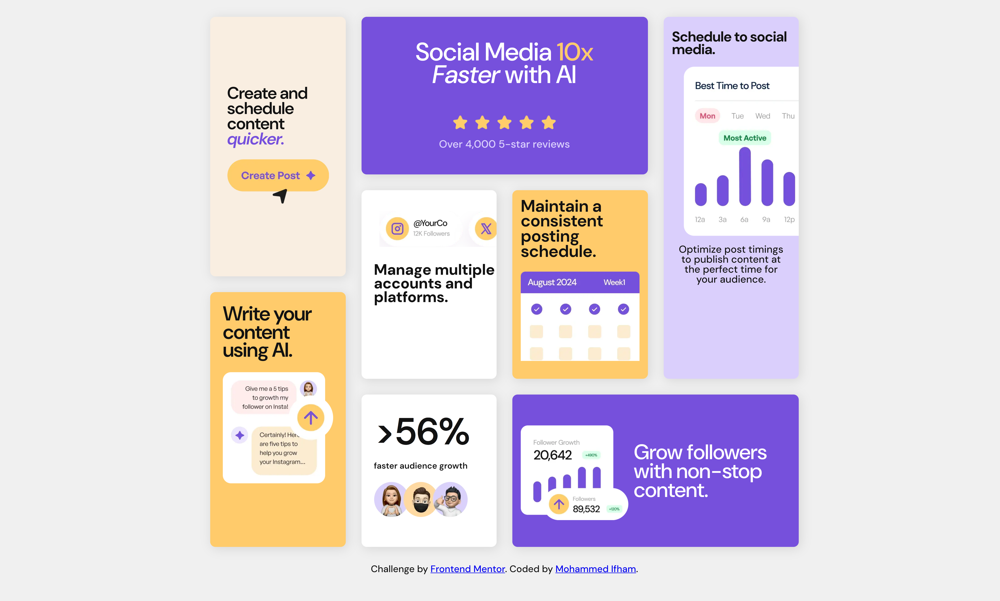

# Frontend Mentor - Bento grid solution

This is a solution to the [Bento grid challenge on Frontend Mentor](https://www.frontendmentor.io/challenges/bento-grid-RMydElrlOj).

## Table of contents

- [The Challenge](#the-challenge)
- [Screenshot](#screenshot)
- [Links](#links)
- [Built with](#built-with)
- [Continued development](#continued-development)

### The Challenge

This is design layout of multiple cards organized in a Bento grid. Users should be able to view the optimal layout for the interface depending on their device's screen size.

### Screenshot

### Links

- [Live Site URL](https://whimsical-biscotti-0580fb.netlify.app/)
- [Solution URL](https://www.frontendmentor.io/solutions/bento-grid-main-oM0AKT1Sy7)

### Built with

- Semantic HTML5 markup
- SCSS/SASS
- Flexbox
- CSS Grid
- Mobile-first workflow

### Continued development

It's almost perfect,  but I need to explore more on, CSS Grid so I can improve the layout across all screen sizes. Also, I tried SASS/SCSS the first time. It turned out pretty good. But I am still on the beginner level when it comes to SASS, I am continuing to improve myself on it.